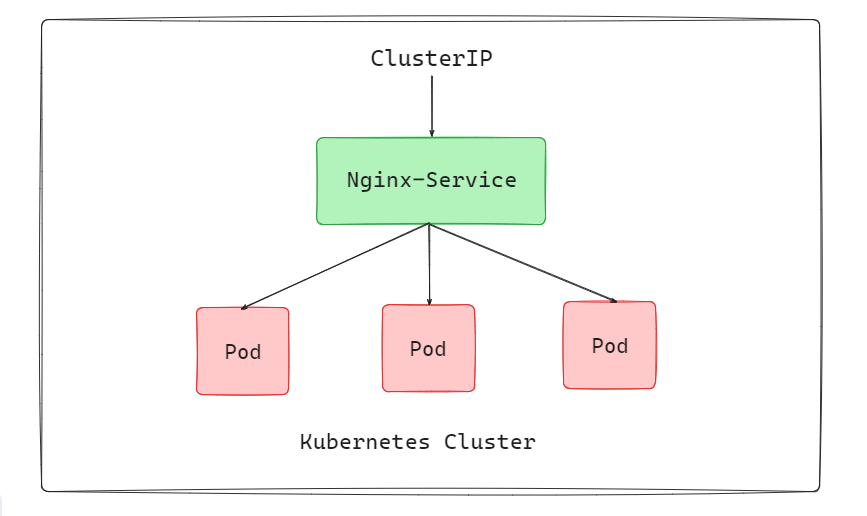

# Kubernetes Service Using ClusterIP

## ClusterIP


ClusterIP is the default service type in Kubernetes, and it provides internal connectivity between different components of our application. Kubernetes assigns a virtual IP address to a ClusterIP service that can solely be accessed from within the cluster during its creation. This IP address is stable and doesn’t change even if the pods behind the service are rescheduled or replaced.

## Accessing Kubernetes Services via ClusterIP

This guide outlines the steps to create a nginx-deployment service and accessing the service using clusterIP. The final goal is to access the targeted nginx-pod and curl the application using ClusterIP internally within the cluster.



## Prerequisites

Install vim for creating YAML files in the system.

```bash
sudo apt update
sudo apt install vim
```

## Steps

### 1. Create Nginx-deployment File

Let's create a Nginx-deployment file with three replica of pods running:

```bash
apiVersion: apps/v1
kind: Deployment
metadata:
  name: nginx-deployment
spec:
  replicas: 3
  selector:
    matchLabels:
      app: nginx
  template:
    metadata:
      labels:
        app: nginx
    spec:
      containers:
      - name: nginx
        image: nginx:latest
        ports:
        - containerPort: 80
```

use ``vim nginx-deployment.yaml`` and write the yaml file pressing ``i`` for INSERT and exit using ``esc`` and ``:wq``.

Now, see the yaml file using ``cat nginx-deployment.yaml``.

### 2. Create Nginx-service File

Let's write a YAML manifest file for the Nginx-deployment file which specifies the service type as NodePort, allowing external access to the service.

```bash
apiVersion: v1
kind: Service
metadata:
  name: nginx-service
spec:
  selector:
    app: nginx
  ports:
    - protocol: TCP
      port: 80
      targetPort: 80
  type: ClusterIP
```
use ``vim nginx-service.yaml`` and write the yaml file pressing ``i`` for INSERT and exit using ``esc`` and ``:wq``.

Now, see the yaml file using ``cat nginx-service.yaml``.

### 3. Create Deployment and Service

To create the deployment and service, run the following commands:

```bash
kubectl apply -f nginx-deployment.yaml
kubectl apply -f nginx-service.yaml
```

### 4. Check Deployment and Service

Check the status of the deployment using:

```bash
kubectl get deployments
```

Check the status of the service using:

```bash
kubectl get services
```

We can also get all the information by using ``kubectl get all``


If the pods and services are runnung, we are ready for accessing Nginx using ClusterIP within the cluster.

### 5. Get the ClusterIP

To get the clusterIP of the service in a Kubernetes cluster, we can use the kubectl command-line tool to fetch this information. Here's how:

```bash
kubectl get services
```


### 6. Curl using ClusterIP

We can access the Nginx server through the clusterIP of the nginx service internally.

```bash
curl 10.43.86.189:80
```

## Expected Output


