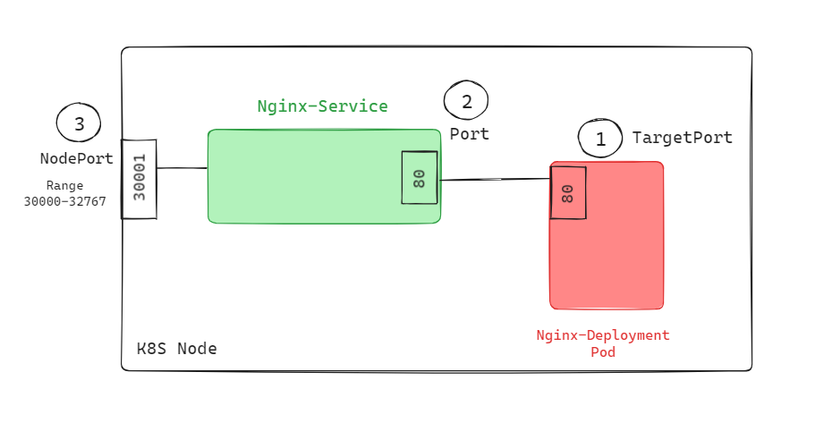
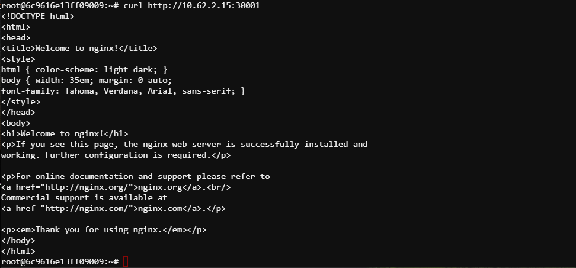

# Kubernetes Service Using NodePort

## Accessing Kubernetes Services via NodePort

This guide outlines the steps to create a nginx-deployment service and accessing the service using nodeport. The final goal is to access the targeted nginx-pod and curl the application using NodePort externally.



## Prerequisites

Install vim for creating YAML files in the system.

```bash
sudo apt update
sudo apt install vim
```

## Steps

### 1. Create Nginx-deployment File

Let's create a Nginx-deployment file with three replica of pods running:

```bash
apiVersion: apps/v1
kind: Deployment
metadata:
  name: nginx-deployment
spec:
  replicas: 3
  selector:
    matchLabels:
      app: nginx
  template:
    metadata:
      labels:
        app: nginx
    spec:
      containers:
      - name: nginx
        image: nginx:latest
        ports:
        - containerPort: 80
```

use ``vim nginx-deployment.yaml`` and write the yaml file pressing ``i`` for INSERT and exit using ``esc`` and ``:wq``.

Now, see the yaml file using ``cat nginx-deployment.yaml``.

### 2. Create Nginx-service File

Let's write a YAML manifest file for the Nginx-deployment file which specifies the service type as NodePort, allowing external access to the service.

```bash
apiVersion: v1
kind: Service
metadata:
  name: nginx-service
spec:
  type: NodePort
  selector:
    app: nginx
  ports:
    - port: 80
      targetPort: 80
      nodePort: 30001
```
use ``vim nginx-service.yaml`` and write the yaml file pressing ``i`` for INSERT and exit using ``esc`` and ``:wq``.

Now, see the yaml file using ``cat nginx-service.yaml``.

### 3. Create Deployment and Service

To create the deployment and service, run the following commands:

```bash
kubectl apply -f nginx-deployment.yaml
kubectl apply -f nginx-service.yaml
```

### 4. Check Deployment and Service

Check the status of the deployment using:

```bash
kubectl get deployments
```

Check the status of the service using:

```bash
kubectl get services
```

We can also get all the information by using ``kubectl get all``


If the pods and services are runnung, we are ready for accessing Nginx using NodePort.

### 5. Get the Internal IP

To get the IP address of the node in a Kubernetes cluster, we can use the kubectl command-line tool to fetch this information. Here's how:

```bash
kubectl get nodes -o wide
```


### 6. Curl using NodePort

We can access the Nginx server through any of our Kubernetes cluster nodes' IP addresses, on port 30001.

```bash
curl http://10.62.2.15:30001
```

## Expected Output


